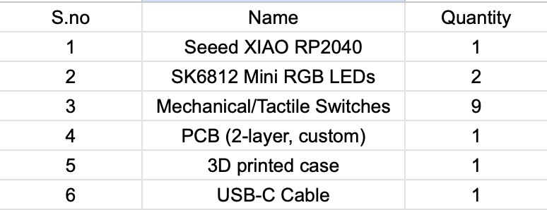

# Macropad-101
# 9-Key Macropad 

This is my custom 9-key macropad project.  
I designed the PCB in KiCad, created a simple case in Fusion 360 ,  
and wrote the firmware using KMK on a Seeed XIAO RP2040.

Even though this is my first time doing PCB and CAD together, I wanted some background lighting so I added RGB on the back of the pcb.

---

##  Project Photos

### PCB Layout  

### Schematic  

### Assembled Board  

### Case (Fusion 360)  

##  BOM Image

Here is a visual overview of all the parts I used:

---

## Why These 9 Shortcuts?

I wanted shortcuts that I use constantly, either for coding or just daily use.
Here’s the logic behind each row:

###  **Top Row – Audio Controls**
1. **Volume Down** – quick sound adjustment  
2. **Mute** – useful during calls or when someone walks in  
3. **Volume Up** – because everything is too quiet sometimes  

These three are simple, universal, and felt right as the “top bar.”

---

### **Middle Row**
4. **Open Terminal** – I open terminal windows constantly  
5. **Open YouTube** – background videos/music while I work  
6. **Open VS Code** – my main coding environment  

These shortcuts save me a ton of time. Instead of searching or alt-tabbing,
I can just tap a key.

---

###  **Bottom Row**
7. **Screenshot** – I take screenshots very often (errors, memes, notes)  
8. **VS Code Terminal Toggle** – I switch terminals repeatedly while coding  
9. **Open KiCad** – since I'm always tweaking my PCB design, having this shortcut made sense  

I chose shortcuts based on what I genuinely use dozens of times a day.  
This macropad ended up improving my workflow more than I expected.

---

## RGB Lighting

I added two SK6812 RGB LEDs for the background lighting and the gamer vibe
---

##  Case Design
I used fusion 360 for the design of the case which was hell lotta fun ngl
---

