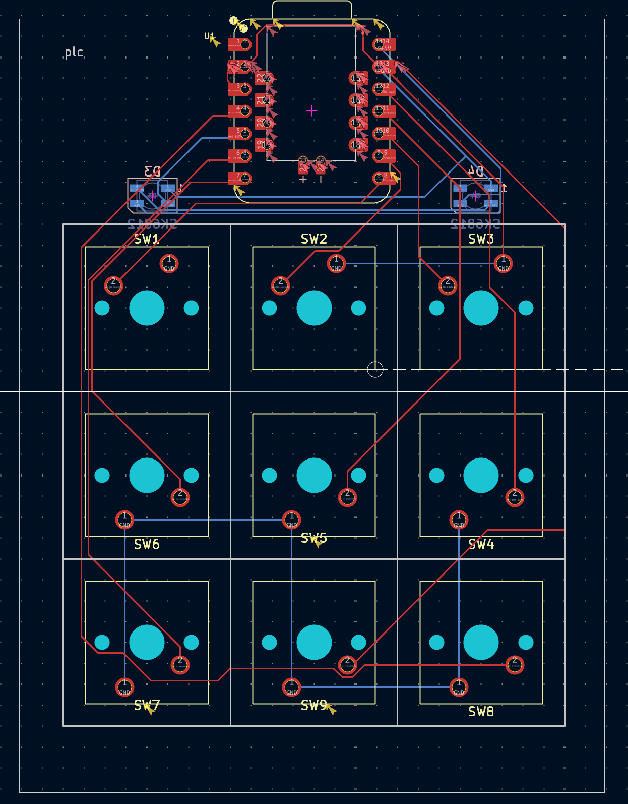
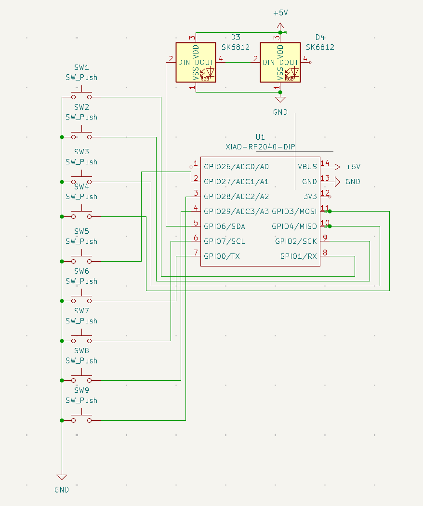
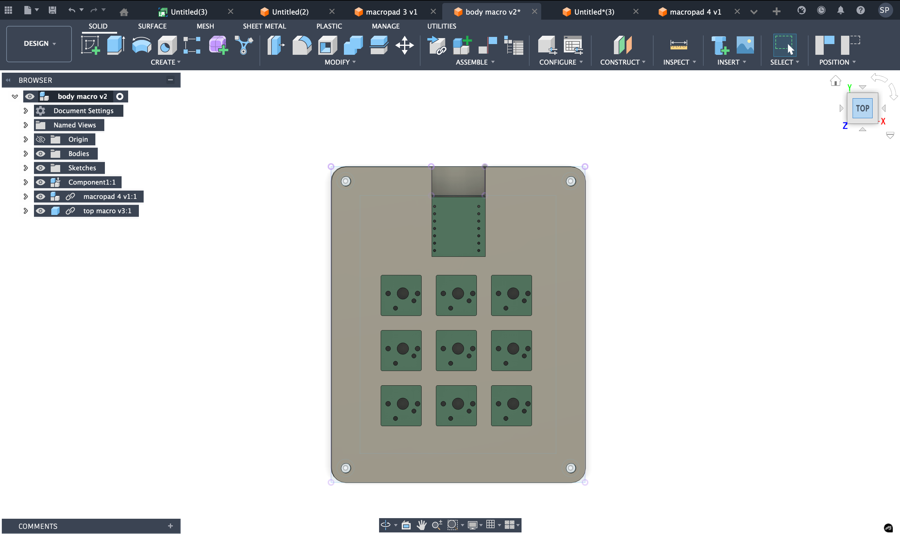
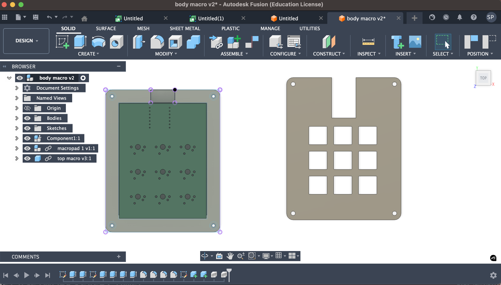

# Macropad-101
# 9-Key Macropad (KMK + RGB + Custom PCB)

This is my custom 9-key macropad project.  
I designed the PCB in KiCad, created a simple case in Fusion 360 (my first time using it),  
and wrote the firmware using KMK on a Seeed XIAO RP2040.

Even though this is my first time doing PCB + CAD together, I wanted something that felt
useful, clean, and a little flashy — so I added RGB.

---

## 📸 Project Photos

### PCB Layout  

### Schematic  

### Assembled Board  

### Case (Fusion 360)  

---

## 🎯 Why These 9 Shortcuts?

I wanted shortcuts that I use constantly, either for coding or just daily use.
Here’s the logic behind each row:

### 🔊 **Top Row – Audio Controls**
1. **Volume Down** – quick sound adjustment  
2. **Mute** – useful during calls or when someone walks in  
3. **Volume Up** – because everything is too quiet sometimes  

These three are simple, universal, and felt right as the “top bar.”

---

### 💻 **Middle Row – Apps I Use All the Time**
4. **Open Terminal** – I open terminal windows constantly  
5. **Open YouTube** – background videos/music while I work  
6. **Open VS Code** – my main coding environment  

These shortcuts save me a ton of time. Instead of searching or alt-tabbing,
I can just tap a key.

---

### 🧰 **Bottom Row – Utility Actions**
7. **Screenshot** – I take screenshots very often (errors, memes, notes)  
8. **VS Code Terminal Toggle** – I switch terminals repeatedly while coding  
9. **Open KiCad** – since I'm always tweaking my PCB design, having this shortcut made sense  

I chose shortcuts based on what I genuinely use dozens of times a day.  
This macropad ended up improving my workflow more than I expected.

---

## 🌈 RGB Lighting

I added two SK6812 RGB LEDs because:

- Good lighting makes any project look more polished  
- Easy to control with KMK  
- I wanted to learn how to wire addressable LEDs  

They’re simple, but they add a nice touch.

---

## 🛠 Case Design (My First Time Using Fusion 360)

This was my first real project in Fusion 360.

What I learned:

- Aligning components and bodies took some trial and error  
- Positioning the PCB inside the case was harder than it looked  
- Exporting STEP files is surprisingly important  
- Eventually everything clicked, and the final result came out better than expected  

I kept the case simple and functional since it's my first attempt.

---

